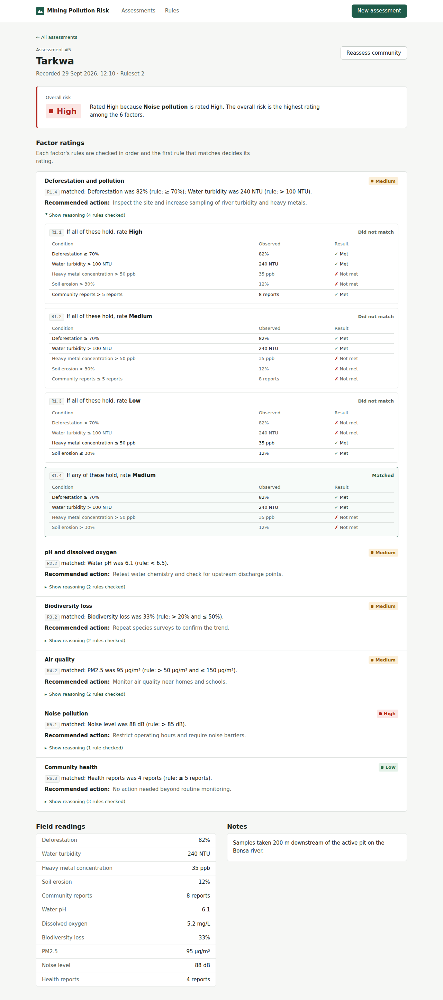
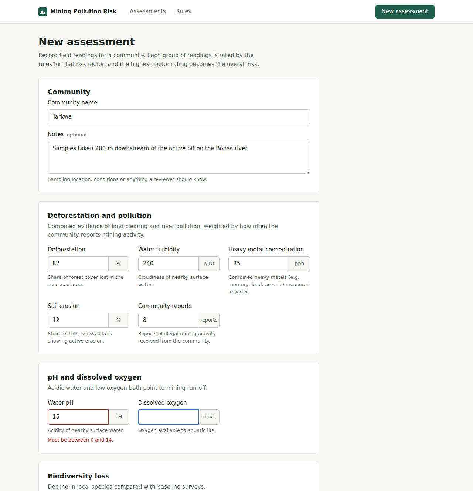
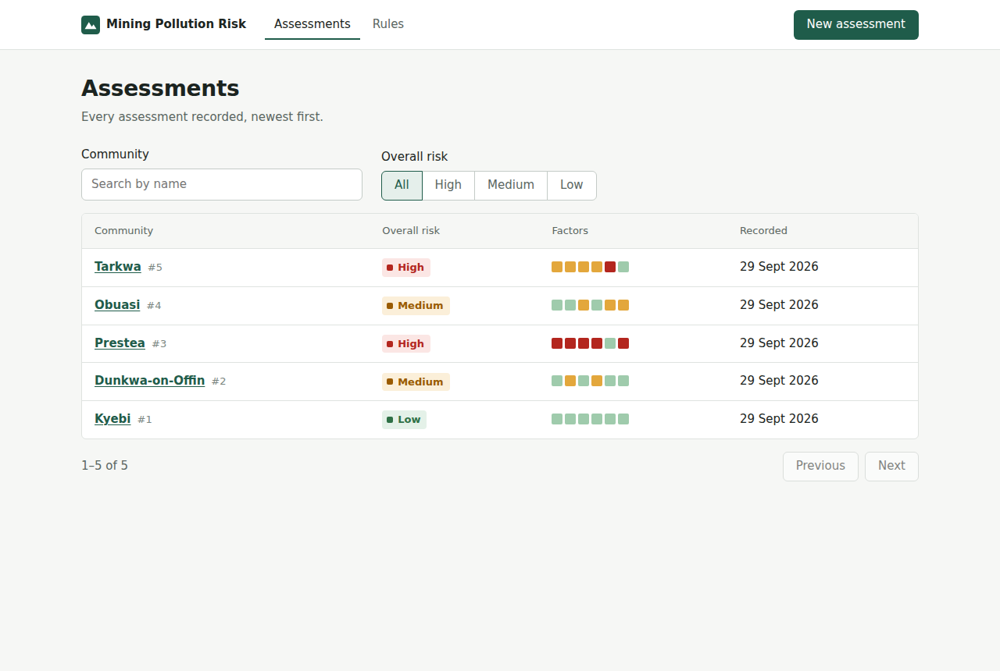
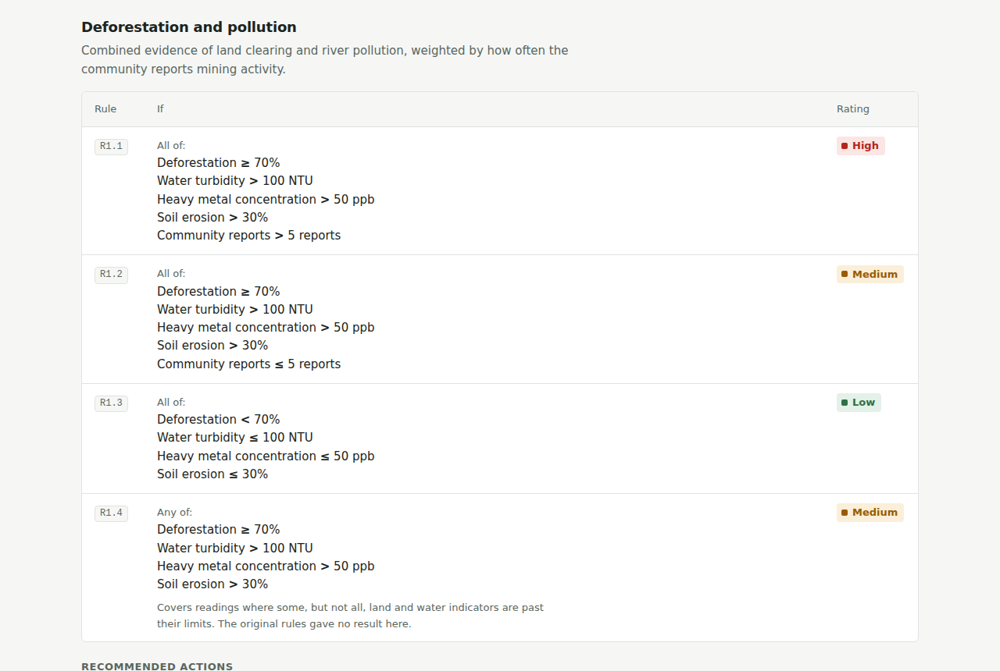
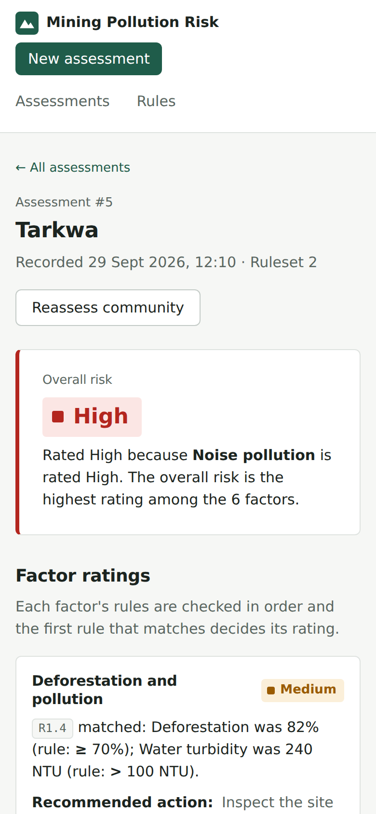

# Expert System – Illegal Mining Pollution Risk Assessment

A rule-based expert system that rates the pollution risk illegal mining poses to a
community. An assessor records eleven field readings; the system rates six risk
factors with fixed threshold rules, combines them into an overall risk of **Low**,
**Medium** or **High**, recommends actions, and saves every assessment with a full
explanation of which rules fired and why.

## Screenshots

The screenshots use example readings.

**Assessment result:** the overall risk with its reason, each factor's rating, the rule
that decided it and a recommended action. Here the reasoning for the first factor is
expanded to show every rule checked.



**New assessment:** readings grouped by risk factor, with units and range checks as you type.



**Assessment history:** search by community, filter by overall risk; the coloured strip
shows the six factor ratings.



**Rules:** the knowledge base as decision tables, generated from the same definitions
the engine uses.



**On a phone:**



## How the reasoning works

```
READINGS ─▶ FACTOR RULES ─────────────────▶ FACTOR RATINGS ─▶ OVERALL RISK ─▶ EXPLANATION
11 values   6 factors, rules tried in       Low / Medium /    highest factor   every rule checked,
            order, first match wins         High per factor   rating           with observed values
```

| Factor                       | Readings                                                                   | High when                                  | Medium when                                        | Low when                              |
| ---------------------------- | -------------------------------------------------------------------------- | ------------------------------------------ | -------------------------------------------------- | ------------------------------------- |
| Deforestation and pollution  | deforestation %, turbidity NTU, heavy metals ppb, soil erosion %, reports  | all of ≥70, >100, >50, >30 **and** >5 reports | all four exceeded with ≤5 reports, **or** only some exceeded (R1.4) | all four within limits            |
| pH and dissolved oxygen      | pH, dissolved oxygen mg/L                                                  | pH <6.5 **and** DO <4                      | pH <6.5 **or** DO <4                               | pH ≥6.5 and DO ≥4                     |
| Biodiversity loss            | biodiversity loss %                                                        | >50                                        | >20 and ≤50                                        | ≤20                                   |
| Air quality                  | PM2.5 µg/m³                                                                | >150                                       | >50 and ≤150                                       | ≤50                                   |
| Noise pollution              | noise dB                                                                   | >85                                        | >60 and ≤85                                        | ≤60                                   |
| Community health             | health reports                                                             | >10                                        | >5 and ≤10                                         | ≤5                                    |

The full knowledge base, including recommended actions, is defined in
[`backend/app/engine/knowledge_base.py`](backend/app/engine/knowledge_base.py) and
shown in the app on the **Rules** page.

## Project structure

```
backend/                Flask API, rule engine, SQLite persistence
  app/engine/           model.py (indicators, conditions, rules, factors),
                        knowledge_base.py (the rules), inference.py (evaluation + trace)
  app/validation.py     input validation driven by the indicator definitions
  app/repository.py     SQLite schema and queries
  app/api.py            HTTP endpoints
  tests/                engine regression, validation and API tests
frontend/               React + TypeScript (Vite)
  src/pages/            New assessment, Assessment result, History, Rules
  src/components/       shared layout and UI pieces
  e2e/                  Playwright tests against the real backend
```

## Running locally

Requirements: Python 3.11+, Node 22+.

```bash
# Backend (http://127.0.0.1:5000)
cd backend
python -m venv .venv
.venv/bin/pip install -r requirements-dev.txt
.venv/bin/flask --app wsgi run

# Frontend (http://localhost:5173, proxies /api to the backend)
cd frontend
npm install
npm run dev
```

### Production

Build the frontend and let the backend serve it from one process:

```bash
cd frontend && npm ci && npm run build
cd ../backend && pip install -r requirements.txt
FRONTEND_DIST=../frontend/dist DATABASE_PATH=/var/lib/mining-risk/assessments.db \
  gunicorn --workers 2 --bind 0.0.0.0:8000 wsgi:app
```

| Variable        | Default                          | Purpose                                            |
| --------------- | -------------------------------- | -------------------------------------------------- |
| `DATABASE_PATH` | `backend/instance/assessments.db` | SQLite file; created and migrated on start-up     |
| `FRONTEND_DIST` | _(unset)_                        | Built frontend to serve; unset for API only        |
| `LOG_LEVEL`     | `INFO`                           | Python logging level                               |

## API

All responses are JSON. Errors use `{"error": {"code", "message", "fields"?}}`.

| Method | Path                     | Description                                                                 |
| ------ | ------------------------ | --------------------------------------------------------------------------- |
| GET    | `/api/health`            | Liveness check                                                              |
| GET    | `/api/knowledge-base`    | Indicators (units, accepted ranges), factors, rules and recommendations     |
| POST   | `/api/assessments`       | Validate, evaluate and save. `201` with the record, `400` with field errors |
| GET    | `/api/assessments`       | List, newest first. Query: `q` (community), `risk`, `limit` ≤100, `offset`  |
| GET    | `/api/assessments/{id}`  | One assessment with readings and the full evaluation trace                  |
| GET    | `/api/communities`       | Previously assessed community names, most recent first                      |

`POST /api/assessments` body:

```json
{
  "community": "Tarkwa",
  "notes": "Sampled 200 m downstream of the pit",
  "observations": {
    "deforestation": 82, "turbidity": 240, "heavy_metals": 35, "soil_erosion": 12,
    "reports": 8, "ph": 6.1, "dissolved_oxygen": 5.2, "biodiversity_loss": 33,
    "pm25": 95, "noise_level": 88, "health_reports": 4
  }
}
```

## Checks

```bash
cd backend  && .venv/bin/ruff check . && .venv/bin/ruff format --check . && .venv/bin/mypy && .venv/bin/pytest
cd frontend && npm run lint && npm run format:check && npm test && npm run build && npm run e2e
```

`npm run e2e` starts the Flask backend against a temporary database and runs the
Playwright suite on desktop and mobile viewports. It needs `backend/.venv` and a
build of the frontend.

## Design decisions

- **Rules as data, evaluated by a small engine.** Rules are declarative
  (`Rule(id, conclusion, conditions, match="all"|"any")`), so the same definitions
  drive evaluation, the explanation trace, the API's knowledge-base endpoint and
  the Rules page. The engine is deterministic and has no dependency on Flask.
- **Prolog removed.** The original `illegaiminingsystem.pl` was never called by the
  backend (the Flask app re-implemented the rules in Python) and could not run as
  written (`pH` is an atom, not a variable, so the pH/oxygen rule never matched).
  Keeping two copies of the rules would let them drift, so the Python engine is
  the single source of truth. The original Flask rule functions are kept verbatim
  in `backend/tests/legacy_reference.py` as a regression oracle.
- **Stored results are immutable.** Each assessment stores the evaluation exactly
  as produced, with the ruleset version, so history stays accurate if rules change.
  There is no edit or delete endpoint.
- **No user accounts.** The original system had no authentication, and none was
  added. Anyone who can reach the server can record and read assessments; deploy
  it behind your organisation's network or an authenticating proxy if that is not
  acceptable.
- **Vite instead of Create React App.** CRA is deprecated and `react-scripts` 5 does
  not support React 19 properly. The frontend is now TypeScript on Vite.
- **SQLite.** One file, no extra service, enough for a field-assessment workload.
  WAL mode and a busy timeout handle concurrent gunicorn workers.

## Behaviour changes from the original

| Area | Original | Now | Why |
| --- | --- | --- | --- |
| Factor 1 gap | Readings where only some land/water limits were exceeded (e.g. deforestation 80%, turbidity 20) matched no rule: Flask returned `null`, Prolog failed | New rule **R1.4** rates these **Medium** | Every input must get a rating. Medium matches the existing rules: worse than all-within-limits (Low), not the full-evidence High |
| Missing inputs | Missing fields silently defaulted (0, pH 7, DO 5) | All 11 readings are required; values are range-checked | A missing reading is not evidence of safety |
| Input names | `pH`, `DO` | `ph`, `dissolved_oxygen` | Consistent snake_case keys |
| Endpoint | `POST /check_risk`, result not stored | `POST /api/assessments`, stored with explanation | Adds the history and explanation the README described |
| Recommendations | Mentioned in README, not implemented | One recommended action per factor and level | As described in the original README |

All other thresholds and the overall-risk rule (highest factor wins) are
unchanged; `test_matches_legacy_implementation_across_threshold_grid` checks the
engine against the original functions on every combination of boundary values.

## Author

**Kelly Buabeng** · Accra, Ghana · kbbuabeng002@st.ug.edu.gh
